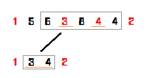

划分树是一种来解决区间第 $K$ 大的一种数据结构，其常数、理解难度都要比主席树低很多。同时，划分树紧贴“第 $K$ 大”，所以是一种基于排序的一种数据结构。

 **建议先学完主席树再看划分树哦** 

## 建树

划分树的建树比较简单，但是相对于其他树来说比较复杂。

如图，每一层都有一个看似无序的数组。其实，每一个被红色标记的数字都是 **要分配到左儿子的** 。而分配的规则是什么？就是与 **这一层的中位数** 做比较， $\leq$ 左边，否则右边。但是这里要注意一下：并不是严格的 $\leq$  **左边，否则右边** 。因为中位数可能有相同，而且与 $N$ 的奇偶有一定关系。下面的代码展示会有一个巧妙的运用，大家可以参照代码。

我们不肯能每一次都对每一层排序，这样子不说常数，就算是理论复杂度也过不去。我们想，找中位数，一次排序就够了。为什么？比如，我们求 $l,r$ 的中位数，其实就是在排完序过后的 $num[mid]$ 。

两个关键数组：

```text
tree[log(N),N]   : 也就是树,要存下所有的值,空间复杂度 $O(n\log n)$。
toleft[log(N),n] : 也就是每一层 1~i 进入左儿子的数量,这里需要理解一下,这是一个前缀和。
```

```pascal
procedure Build(left,right,deep:longint); // left,right 是左右区间,deep是第几层
var
	i,mid,same,ls,rs,flag:longint; // 其中 flag 是用来平衡左右两边的数量的
begin
	if left=right then exit; // 到底层了
	mid:=(left+right) >> 1;
	same:=mid-left+1;
	for i:=left to right do 
		if tree[deep,i]<num[mid] then
			dec(same);

	ls:=left; // 分配到左儿子的第一个指针
	rs:=mid+1; // 分配到右儿子的第一个指针
	for i:=left to right do
	begin
		flag:=0;
		if (tree[deep,i]<num[mid])or((tree[deep,i]=num[mid])and(same>0)) then // 分配到左边的条件
		begin
			flag:=1; tree[deep+1,ls]:=tree[deep,i]; inc(ls);
			if tree[deep,i]=num[mid] then // 平衡左右个数
				dec(same);
		end
		else
		begin
			tree[deep+1,rs]:=tree[deep,i]; inc(rs);
		end;
		toleft[deep,i]:=toleft[deep,i-1]+flag;
	end;
	Build(left,mid,deep+1); // 继续
	Build(mid+1,right,deep+1);
end;
```

## 查询

那我们先扯一下主席树的内容。在用主席树求区间第 $K$ 小的时候，我们以 $K$ 为基准，向左就向左，向右要减去向左的值，在划分树中也是这样子的。

查询难理解的，在于 **区间缩小** 这种东西。下图，我查询的是 $3$ 到 $7$ , 那么下一层我就只需要查询 $2$ 到 $3$ 了。当然，我们定义 $left,right$ 为缩小后的区间（目标区间）， $l,r$ 还是我所在节点的区间。那为什么要标出目标区间呢？因为那是 **判定答案在左边，右边的基准** 。



```pascal
function Query(left,right,k,l,r,deep:longint):longint;
var
	mid,x,y,cnt,rx,ry:longint;
begin
	if left=right then // 写成 l=r 也无妨,因为目标区间也一定有答案
		exit(tree[deep,left]);
	mid:=(l+r) >> 1;
	x:=toleft[deep,left-1]-toleft[deep,l-1]; // l 到 left 的去左儿子的个数
	y:=toleft[deep,right]-toleft[deep,l-1]; // l 到 right 的去左儿子的个数
	ry:=right-l-y; rx:=left-l-x; // ry 是 l 到 right 去右儿子的个数,rx 则是 l 到 lefr 去右儿子的个数
	cnt:=y-x; // left 到 right 左儿子的个数
	if cnt>=k then // 主席树常识啦
		Query:=Query(l+x,l+y-1,k,l,mid,deep+1) // l+x 就是缩小左边界,l+y-1 就是缩小右区间。对于上图来说,就是把 1 和 2 放弃了。
	else
		Query:=Query(mid+rx+1,mid+ry+1,k-cnt,mid+1,r,deep+1); // 同样是缩小区间,只不过变成了右边而已。注意要 k-cnt。
end;
```

## 理论复杂度和亲测结果

时间复杂度 : 一次查询只需要 $O(\log n)$ , $m$ 次询问，就是 $O(m\log n)$ 。

空间复杂度 : 只需要存储 $O(n\log n)$ 个数字。

亲测结果：主席树 : $1482 \text{ms}$ 、划分树 : $889 \text{ms}$ 。（非递归，常数比较小）

## 后记

大家可以试着去写非递归版哦。参考博文 :[传送门](https://blog.csdn.net/littlewhite520/article/details/70250722)。
