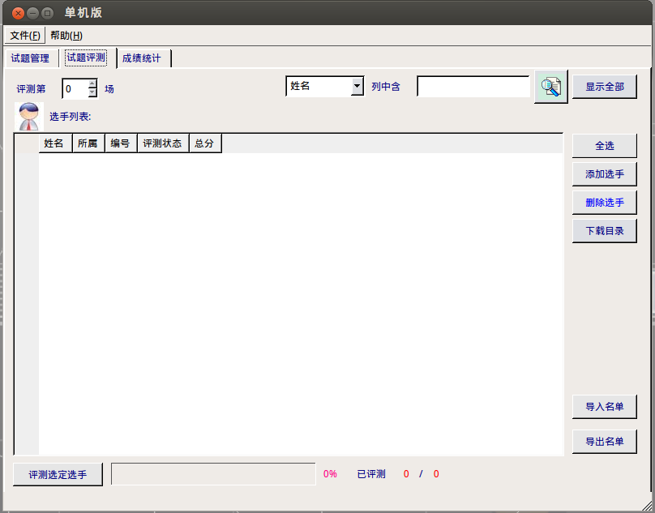
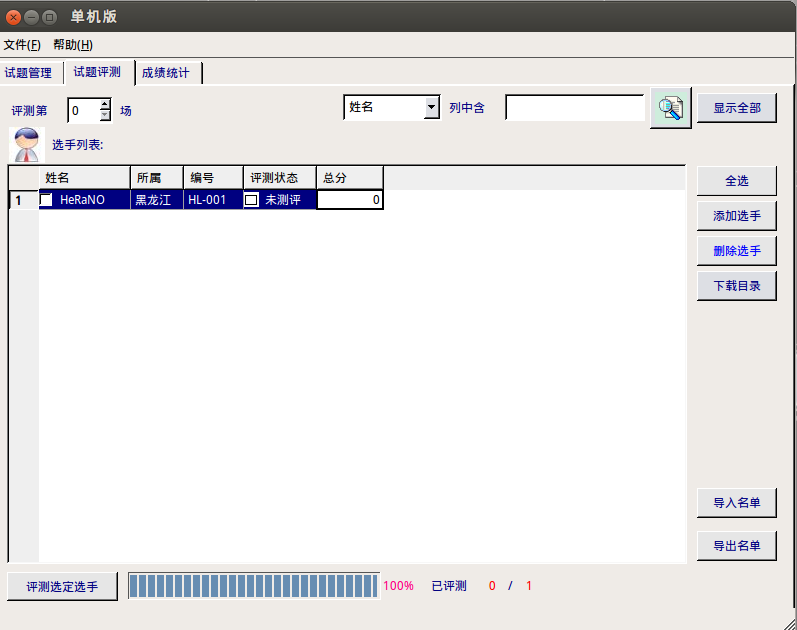

很多时候，你拿到了一套题，想要在本地测试一下自己能得多少分，这时候就需要评测软件了。

## Cena

Cena 是由刘其帅和李子星使用 Pascal 语言编写的开源评测工具，是流传最广泛的本地评测工具。Cena 最初开源于 Google Code 平台，由于不明原因 Google 删除了 Cena 项目，目前可以在[Web Archive](https://web.archive.org/web/20131023112258/http://code.google.com/p/cena/)上找到 Cena 的官网。

Cena 的源代码可以在[这里](https://github.com/billchenchina/cena)找到。

Cena 对权限的限制不是很明确，测试的时候可以读测点 AC QAQ

## Lemon

Lemon 是 zhipeng-jia 写的开源的评测工具，仓库 [zhipeng-jia/project-lemon](https://github.com/zhipeng-jia/project-lemon)。

Ir1d 提供了一份 linux 下编译好的版本在 [FreestyleOJ/Project_lemon](https://github.com/FreestyleOJ/Project_lemon/tree/Built)。

Menci 提供了一份更新的版本在 [Menci/Lemon](https://github.com/Menci/Lemon/)。

Dust1404 维护了支持子文件夹和单题测试等功能的版本在 [Dust1404/Project_LemonPlus](https://github.com/Dust1404/Project_LemonPlus)。

 **注意** macOS 下 Lemon 可能会出现内存测试不准确的情况，这是由于 mac 下没有一些 Linux 的监测工具，而 Lemon-Linux 也没有对于 macOS 的使用优化。

### 自行编译

在 Ubuntu 下编译：

```bash
sudo apt update
sudo apt install qt5-default build-essential git -y
git clone --depth=1 http://github.com/menci/lemon.git
cd lemon
# 可以修改 make 文件来调整 make job 的线程数
sed -i 's/make $/make -j 1 $/g' make
./make
cp Lemon ~
cd ..
```

### 数据格式

首先打开 lemon 选择新建试题，而后打开新建试题的文件夹

题目和数据应该如以下格式所示

```text
├── data
│   ├── gendata.py
│   ├── product
│   │   ├── product100.in
│   │   ├── product100.out
│   │   ├── product10.in
│   │   ├── product10.out
│   │   ├── product11.in
...
```

当所有试题添加完成后，回到 lemon 选择自动添加试题

此时你的题目和数据点应该都显示在 lemon 当中了

## Arbiter

Arbiter 为北京航空航天大学为 NOI Linux 开发的评测工具，现已用于各大 NOI 系列程序设计竞赛的评测。据吕凯风在 2016 年冬令营上的讲稿《下一代测评系统》，Arbiter 是由北京航空航天大学的团队（貌似叫 GAIT）在尹宝林老师的带领下开发完成的。不过该测评工具在开发完成后就一直没有维护与更新，导致测评体验极差，和 NOI Linux 自带的 GUIDE 一样沦为选手与教练疯狂吐槽的对象。但是 NOIP 与 NOI 的题目测评是在 Arbiter 下进行的，因此仍然需要了解 Arbiter 的使用方法。

### 使用方法

首先准备好选手源程序文件夹。选手文件夹如 NOIP 格式创建：

```text
players/
| -- <contestant_1's ID>
|     | -- <problem_1>
|     |   `-- <problem_1>.c/cpp/pas
|     | -- <problem_2>
|     |   `-- <problem_2>.c/cpp/pas
|     | ...
|     | -- <problem_x>
|        `-- <problem_x>.c/cpp/pas
| -- <contestant_2's ID>
|     | -- <problem_1>
|     ...
...
```

其中， `<contestant_x's ID>` 指的是选手编号，形如 `<省份>-< 编号 >` ，例如 HL-001,JL-125 等等， `<problem_x>` 指的是题目名称。

当然，在自测时可以使用字母，短线（即 `-` ）和数字的组合作为选手编号。

准备好选手文件夹还不够，需要准备选手名单。名单格式如下：

```text
<contestant_1's ID>, <contestant_1's name>
<contestant_2's ID>, <contestant_2's name>
...
```

其中 `<contestant_x's name>` 表示选手姓名，保存这个文件为纯文本文件，文件编码是 GB2312。

当然也可以手动添加，稍后介绍。

这样的话，选手源程序文件夹已经搞定，现在配置数据。

每组数据的命名格式如下：

```text
<problem_x><y>.in <problem_x><y>.ans
```

其中， `<y>` 是数据编号，编号从 1 开始。

默认测试数据后缀名是 `.ans` ，选手输出的后缀名是 `.out` ，不能混淆。不用将每题的测试数据放置在各自文件夹里，只需要放在一起即可。

这样就准备好了，现在开始测评文件夹的配置。

工具栏 - 应用程序 - 编程 - Arbiter 测评系统，启动 Arbiter。


如果要打开已经建立的比赛，请点击 OPEN，这里新建一个竞赛，选择 New，设置一下名称和比赛目录即可。

注意，需要新建一个文件夹，然后选择其为比赛目录。


在左边试题概要里右键 - 添加考试，再在考试标签上右键 - 添加试题，新建出试题即可。

单击考试左边的 `+` 即可全部显示，单击试题标签对试题名称进行修改，改为题目的英文名称，同时修改题目时间与空间限制和比较方式。比较方式十分不推荐用全文完全直接比较，对于 Windows 下制作的数据十分不友好。比较方式不选的话默认为字符串比较中的单行单字符串比较方式。如果测试数据不同的话一定要注意比较方式的选择！


（建了一些无聊的问题）

这一步 **十分重要：** 点击文件 - 保存！一定要保存，否则没有题目配置文件！每一次对题目配置的修改都要保存！

此时，打开考试文件夹，会发现有如下内容。

```text
<name>/
| -- data
| -- evaldata
| -- filter
| -- final
| -- players
| -- result
| -- tmp
`-- day1.info
`-- player.info
`-- setup.cfg
`-- task1_1.info
`-- task1_2.info
`-- task1_3.info
`-- team.info
```

我们把已经建好的选手程序文件夹放在 `players/` 目录下，将所有测试数据（不放在文件夹里）放在 `evaldata` 中。

 `filter/` 文件夹放置了一些比较器及其源代码，写自定义比较器时可以参考， `result/` 文件夹存放选手的测评结果， `tmp/` 文件夹是测评时文件夹。

配置好后，就是正式测评环节了。点开“试题评测”标签，然后会出现如下所示情况。



如果已经建立好选手名单了，选择右边的导入名单进行导入。如果人数较少，可以选择右边的添加选手进行导入。

导入好后是这样的。



因为我取得编号是 `HL-001` ，所以会自动识别出“所属”一栏。如果不是 NOIP 规范的编号是识别不出来的。

这个时候，要用 **向上箭头** 把测评第 0 场变为测评第 1 场，如果直接修改的话会识别失败。

然后选择右边的全选，再选择下面的评测选定选手，选择要测评的题目（有全部试题），等待测评结束即可。

### 注意事项，槽点

#### 自定义校验器的编写

注意编译后自定义校验器名称为 `<problem>_e` ，其中 `<problem>` 为题目名称，必须放在 `filter/` 文件夹下。在配置题目时选择自定义校验器，然后选择需要的自定义校验器。

可以参考 `filter/` 下的源代码编写。

#### 测评时注意事项

以下信息均来自敝校教练。

据说很容易死机，需要注意。

据说大量测评时移动鼠标会导致死机，需要注意。

据说不定时闪退，和 Anjuta 一样，需要注意。

据说配置时需要注意权限问题（但是我并未遇到）。

……

#### 诶我怎么只能看见代码不能看见每个点得多少分

测试点详细信息需要在 `result/` 文件夹下查看，文件夹下会有选手的结果文件夹，结果文件的后缀名为 `.result` ，用纯文本方式查看即可。

~~（我觉得这个设计很值得吐槽）~~

#### 诶这个测评系统好难看

我觉得也是……

#### 诶怎么测提交答案题啊

在试题管理中题目配置的地方，将提交方式由源代码改为答案文件。然后选择自定义校验器即可。

#### 诶这个测评系统有没有漏洞

至少不能读取答案文件……

 `bits/stdc++.h` 测得可用。

 `#pragma G++ optimize("O2")` 竟然可用。

 `__attribute__((__optimize__("-O2")))` 竟然也可用。

我可能用的是假 Arbiter……

#### 吐槽

讲个故事：

有一天，一位竞赛教练在用 GUIDE 的时候发现单步调试功能出现了 Bug，于是他致信北航相关项目负责人询问解决办法，得到的回复是：“这个项目已经停止更新了。”

希望一个成熟的线下测评系统早日实现……

## CCR-Plus

一款开源的界面好看的评测工具 GitHub 地址：[sxyzccr/CCR-Plus](https://github.com/sxyzccr/CCR-Plus)
